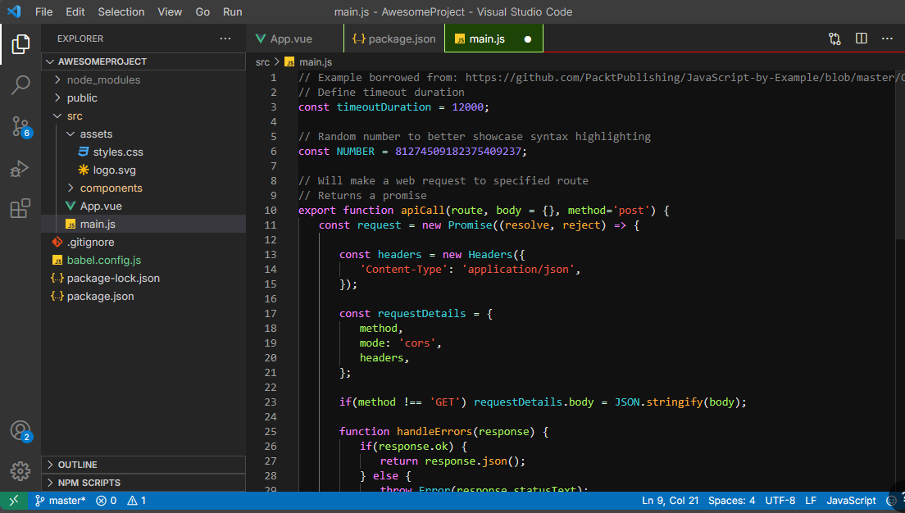

# 9Nights Dark Pro Theme for VS Code 🌙💻

## Overview
**9Nights Dark Pro** is a sleek, modern, and visually appealing dark theme designed for Visual Studio Code. With its unique color palette and focus on eye protection, this theme helps reduce eye strain during long coding sessions, making it perfect for developers who work at night or in low-light environments. 🌑👨‍💻

## Features ✨
- **Eye Protection** 👀: Designed with soft contrast and balanced colors to reduce eye strain.
- **Beautiful Dark Colors** 🌚: A rich, dark color scheme that ensures a comfortable coding experience, even in dim lighting.
- **Syntax Highlighting** 🖋️: Optimized for clarity with vibrant syntax highlighting, making your code stand out.
- **Customizable** 🎨: Easily customizable to fit your personal coding preferences.

## Installation ⚙️

### Using Visual Studio Code Extension Marketplace:
1. Open VS Code.
2. Go to the Extensions view by clicking on the Extensions icon in the Activity Bar on the side of the window.
3. Search for "9Nights Dark Pro".
4. Click **Install**.

## Screenshot

### Manual Installation:
1. Download the theme `.vsix` file from the [Releases Page](https://github.com/ShivSinghB/9nights-dark-pro-theme) (if available).
2. Open VS Code.
3. Go to the Command Palette (`Ctrl+Shift+P` or `Cmd+Shift+P` on macOS).
4. Type "Extensions: Install from VSIX" and select it.
5. Choose the downloaded `.vsix` file.

## Usage 🚀
1. Open the Command Palette (`Ctrl+Shift+P` or `Cmd+Shift+P` on macOS).
2. Type "Color Theme" and select `Preferences: Color Theme`.
3. Choose `9Nights Dark Pro` from the list of available themes.

## Contribution 🤝
Feel free to contribute to the development of the theme! If you have any suggestions, feature requests, or issues, please open an issue or submit a pull request.

## License 📜
This theme is licensed under the MIT License. See [LICENSE](LICENSE) for more information.

## Developed By 🧑‍💻
- **Shiv Singh Baghel**

## 📦 Install

Available on the VS Code Marketplace:  
👉 [9Nights Dark Pro](https://marketplace.visualstudio.com/items?itemName=ShivSinghBaghel.9nights-dark-pro)

## 💡 Why I Made This

I’ve spent countless nights coding, and every theme I tried either felt too harsh or too dull. So I built one that feels just right — modern, minimal, and kind to the eyes.

> Released on: **3rd July 2025 at 3:52:05 PM**

## 🔒 License

MIT © [ShivSinghB](https://github.com/ShivSinghB)

---

Made with ❤️ for devs who code deep into the night.

